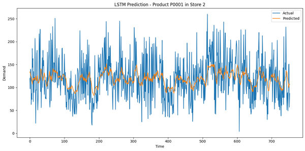

# Demand Forecasting for Retail Sales

## Overview

This project presents a practical and scalable approach to demand forecasting in the retail sector. Using historical sales, promotions, inventory data, and seasonal patterns, we developed a data-driven solution that predicts future product demand. The goal is to help businesses make better decisions regarding stock management, supply planning, and promotional strategy.

## Problem Statement

Retailers often struggle with balancing stock availability and customer demand. Overstocking leads to increased holding costs, while understocking results in missed sales opportunities. Traditional forecasting methods fail to account for the complex and dynamic nature of real-world factors such as seasonality, promotions, and competitor pricing.

The dataset used in this project is titled **“Retail Store Inventory and Demand Forecasting”**, sourced from [Kaggle](https://www.kaggle.com/datasets/atomicd/retail-store-inventory-and-demand-forecasting).

## Our Solution

We built a robust forecasting pipeline that:

- Analyzes daily product-level sales data across stores and regions
- Captures trends, seasonality, promotions, and external conditions
- Predicts future demand using modern machine learning techniques
- Visualizes insights to aid strategic planning and business decision-making

The solution combines scalable data processing with both classical and deep learning methods, making it flexible for both large datasets and time-series modeling.

## Key Highlights

- **Exploratory Analysis** of demand trends across seasons and regions  
  *Figure 1* below illustrates the **overall demand trend** across all products and stores over a two-year period. Peaks and troughs are evident, reflecting strong seasonality and sales cycles.

    
  *Figure 1: Daily total demand across all stores from Jan 2022 to Jan 2024.*

- **Seasonality Mapping** to identify which products peak in different times of year  
  *Figure 2* highlights seasonal demand patterns for a specific product (P0001), colored by season. This allows marketing and supply chain teams to anticipate high-demand windows.

    
  *Figure 2: Seasonal demand distribution for Product P0001 with 15-day rolling average.*

- **Demand Prediction Models** using both traditional regressors and deep learning (LSTM)  
  Our Random Forest model delivered strong predictive accuracy.

    
  *Figure 3: Evaluation metrics of PySpark Random Forest model — RMSE: 17.17, MAE: 13.12, R²: 0.86*

- **Scalability**, allowing the system to handle millions of records using distributed processing

## Results

The project demonstrated the ability to predict demand patterns accurately and consistently. Highlights include:

- Clear visual patterns showing how product demand varies across seasons
- Rolling average demand projections to support logistics and supply chain decisions
- Deep learning models capturing temporal dependencies for high-accuracy forecasting

    
  *Figure 4: LSTM prediction vs. actual demand for Product P0001 in Store 2*

The LSTM model, trained on recent historical sequences, was effective in learning underlying demand dynamics over time, offering smoother forecasts with less volatility.

## Business Impact

- **Reduced Stockouts** by anticipating high-demand periods early  
- **Optimized Inventory** by aligning orders with true demand  
- **Informed Promotions** by identifying when and where to run discounts  
- **Improved Customer Experience** by ensuring product availability  

This enables smarter decision-making across departments — from procurement to marketing — ultimately boosting customer satisfaction and operational efficiency.

## Future Directions

The forecasting system can be extended to:

- Integrate real-time sales data from Point-of-Sale (POS) systems  
- Include external data sources like holidays, social media sentiment, or fuel prices  
- Deploy as a dashboard tool for dynamic forecasting across products and regions  

These extensions will help adapt the system to rapidly changing retail environments and further improve forecast responsiveness.

## About This Project

This project was developed as part of a broader effort to bring AI-driven decision-making into retail operations. It showcases how data science and machine learning can help solve real-world supply chain challenges with tangible business value.

By making forecasting both scalable and accurate, this solution supports smarter inventory control, proactive planning, and measurable cost savings.
